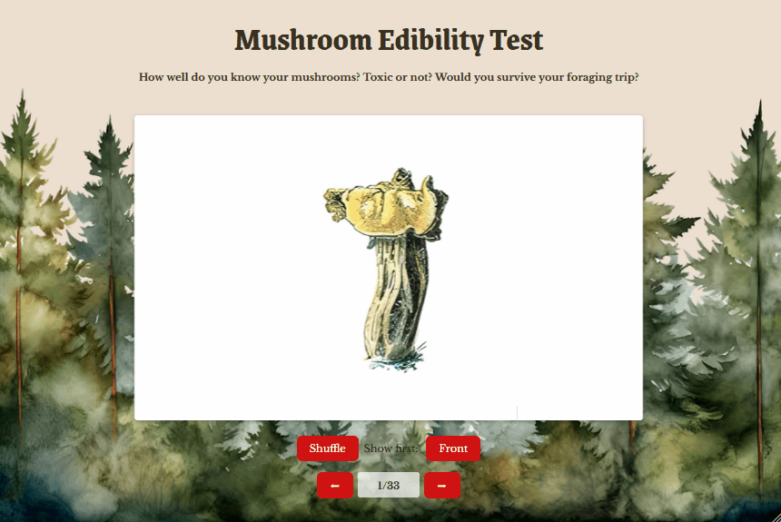

# Web Development Project 2 - *Mushroom edibility test*

Submitted by: **Tatiana Vela**

This web app: **flashcard set showing various mushrooms and their edibility**

Time spent: **10** hours spent in total

## Required Features

The following **required** functionality is completed:

- [x] **The app displays the title of the card set, a short description, and the total number of cards**
  - [x] Title of card set is displayed 
  - [x] A short description of the card set is displayed 
  - [x] A list of card pairs is created
  - [x] The total number of cards in the set is displayed 
  - [x] Card set is represented as a list of card pairs (an array of dictionaries where each dictionary contains the question and answer is perfectly fine)
- [x] **A single card at a time is displayed**
  - [x] Only one half of the information pair is displayed at a time
- [x] **Clicking on the card flips the card over, showing the corresponding component of the information pair**
  - [x] Clicking on a card flips it over, showing the back with corresponding information 
  - [x] Clicking on a flipped card again flips it back, showing the front
- [x] **Clicking on the next button displays a random new card**

The following **optional** features are implemented:

- [x] Cards contain images in addition to or in place of text
  - [x] Some or all cards have images in place of or in addition to text
- [x] Cards have different visual styles such as color based on their category: toxic, edible, not good eating

The following **additional** features are implemented:

* [x] Shuffle cards
* [x] Back/front toggle. Choose whether to show recto or verso first

## Video Walkthrough

Here's a walkthrough of implemented required features:

<!-- Replace this with whatever GIF tool you used! -->
GIF created with [ScreenToGif](https://www.screentogif.com/) for Windows

## Notes

Describe any challenges encountered while building the app.
